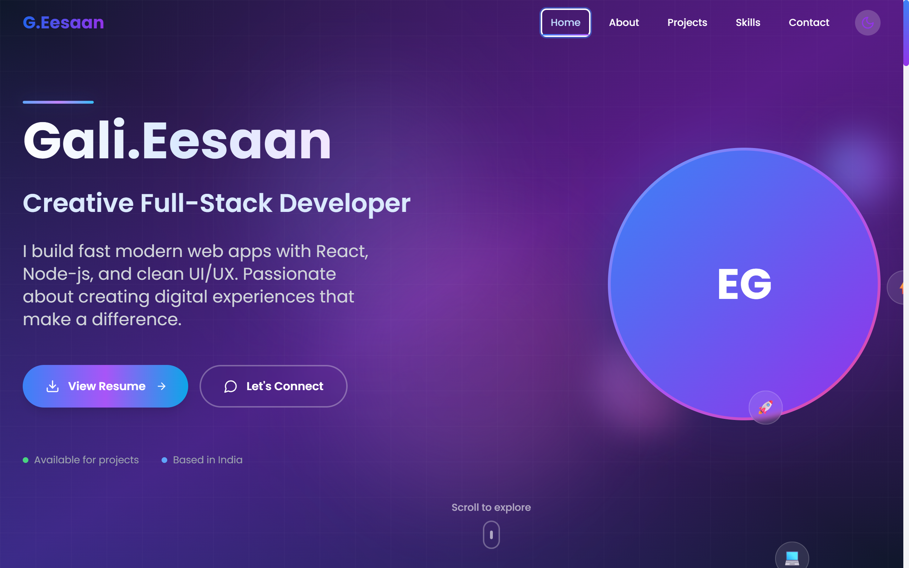

# Eesaan G - Personal Portfolio Website (https://portfolio-black-ten-vxqupdoloq.vercel.app/)



A modern, responsive, and animated personal portfolio website built with React, TypeScript, Tailwind CSS, and Framer Motion. Features a beautiful dark theme with smooth animations and professional design.

## 🚀 Features

- **Modern Design**: Clean, professional design with beautiful gradients and animations
- **Dark Theme**: Elegant dark theme with purple accents and grid patterns
- **Fully Responsive**: Optimized for mobile, tablet, and desktop devices
- **Smooth Animations**: Powered by Framer Motion for engaging user experience
- **Performance Optimized**: Fast loading times and smooth interactions
- **SEO Friendly**: Proper meta tags and semantic HTML structure
- **Modular Architecture**: Clean, maintainable component structure
- **Theme Toggle**: Built-in theme switching capability

## 🛠️ Tech Stack

- **Frontend Framework**: React 18 with TypeScript
- **Styling**: Tailwind CSS with custom configurations
- **Animations**: Framer Motion for smooth transitions and effects
- **Icons**: Lucide React for consistent iconography
- **Font**: Poppins from Google Fonts
- **Build Tool**: Vite for fast development and building
- **State Management**: React Context for theme management
- **Deployment**: Ready for Vercel, Netlify, or any static hosting

## 📁 Project Structure

```
src/
├── components/           # Reusable UI components
│   ├── Navigation.tsx   # Sticky navigation with smooth scrolling
│   ├── Hero.tsx         # Hero section with animated background
│   ├── About.tsx        # About section with animated cards
│   ├── Projects.tsx     # Projects showcase with hover effects
│   ├── Skills.tsx       # Skills grid with progress bars
│   ├── Contact.tsx      # Contact form with success animation
│   ├── Footer.tsx       # Footer with social links
│   └── ThemeToggle.tsx  # Theme switching component
├── contexts/            # React contexts
│   └── ThemeContext.tsx # Theme state management
├── hooks/               # Custom React hooks
│   └── useActiveSection.ts # Active section tracking
├── App.tsx              # Main app component
├── main.tsx            # React app entry point
├── index.css           # Global styles and Tailwind imports
└── vite-env.d.ts       # Vite type definitions
```

## 🚀 Getting Started

### Prerequisites

- Node.js (v16 or higher)
- npm or yarn

### Installation

1. Clone the repository:
```bash
git clone https://github.com/Brainstorm-collab/portfolio.git
cd portfolio
```

2. Install dependencies:
```bash
npm install
```

3. Start the development server:
```bash
npm run dev
```

4. Open your browser and visit `http://localhost:5173`

### Building for Production

```bash
npm run build
```

The build files will be generated in the `dist` directory.

## 🌐 Deployment
https://portfolio-black-ten-vxqupdoloq.vercel.app/

### Vercel

1. Push your code to a GitHub repository
2. Connect your repository to Vercel
3. Deploy with default settings

### Netlify

1. Run `npm run build` to generate the build files
2. Upload the `dist` folder to Netlify
3. Configure the site settings as needed

### Custom Hosting

Upload the contents of the `dist` folder to your web server.

## 🎨 Customization

### Colors

The color scheme can be customized in `tailwind.config.js`:

```javascript
colors: {
  primary: {
    // Your primary color shades
  },
  secondary: {
    // Your secondary color shades
  },
}
```

### Content

Update the personal information in each component:

- **Hero.tsx**: Name, subtitle, and profile information
- **About.tsx**: Professional summary and background
- **Projects.tsx**: Your project showcases
- **Skills.tsx**: Your technical skills and proficiency
- **Contact.tsx**: Contact information and social links

### Fonts

The project uses Poppins font. To change it:

1. Update the Google Fonts link in `index.html`
2. Modify the font family in `tailwind.config.js`
3. Update the font import in `src/index.css`

## 📱 Responsive Design

The website is fully responsive with breakpoints:

- **Mobile**: < 768px
- **Tablet**: 768px - 1024px  
- **Desktop**: > 1024px

## ⚡ Performance

- Lazy loading for images
- Optimized animations with Framer Motion
- Minimal bundle size with tree shaking
- Fast development with Vite
- CSS optimization with Tailwind's purge

## 🔧 Development Scripts

- `npm run dev` - Start development server
- `npm run build` - Build for production
- `npm run preview` - Preview production build
- `npm run lint` - Run ESLint


## 🤝 Contributing

Contributions, issues, and feature requests are welcome! Feel free to check the issues page.

## 📞 Contact

**Eesaan G**
- Email: galieesaan@gmail.com
- LinkedIn: [Eesaan G - LinkedIn](https://www.linkedin.com/in/eesaan-gali-11o42k5)
- GitHub: [Brainstorm-collab](https://github.com/Brainstorm-collab)

---

⭐ Star this repository if you found it helpful!
